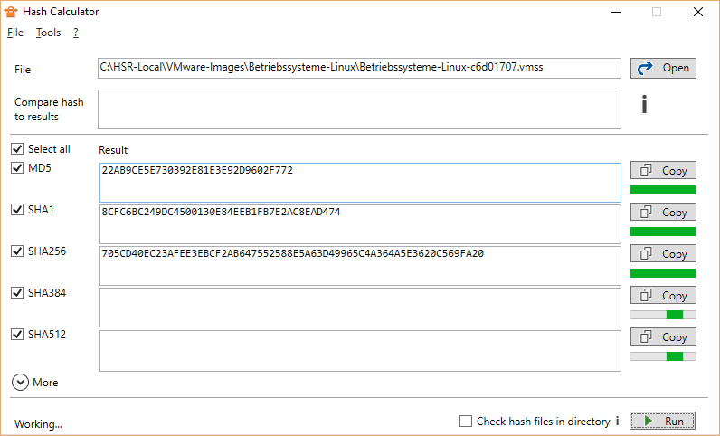

## Description
A multi-threaded, parallel Hash Calculator.

## Installation / Download
[Download](//raw.githubusercontent.com/lroellin/hash-calculator/master/Hash-Calculator/Hash-Calculator/publish/setup.exe)

It's a ClickOnce application, so you can choose to update whenever you start it.

## Features
* Parallel calculation of hash values
* Compare hashes
* Save hash values to file
* Check hash values in file (e.g. .md5, also see [FAQ](#faq))
* See runtime for each algorithm (hover over progress bar)
* Algorithms
  * MD5
  * SHA1
  * SHA256
  * SHA384
  * SHA512
  * More
    * RIPEMD160

### Multi-Threading
* A multi-core machine can run several algorithms simultaneously
* When using several algorithms, you don't have to wait for SHA512 (slow) to finish to display the value of MD5 (fast)
* The GUI does not freeze and is still usable

I did not find a decent Hash Calculator that supports all this. That does not mean other developers are incompetent, it just got a lot easier in the last years to program multi-threaded.

## FAQ
* My hash value files are not found or incorrect
  * Hash Calculator only supports a limited range of hash files. The file names are displayed in the GUI and it only supports files of the following formats
    * `<hash><space><anything>` (tools like md5sum)
    * `<hash>`
  * It only supports per-file hash files. So e.g. MD5SUM or MD5SUMS is not supported
  * The file name needs to be `<full file name>.<hash>`. `<full file name>` needs to include all file extensions like `.exe`
* I cannot run it as another user or Administrator
  * ClickOnce applications cannot be run as an Administrator or any other user

## Changelog
* 1.4.6
  * Fix: Reverted compare change, multi-threading leads to a race condition
* 1.4.5
  * Enhancement: Icons and other UX
  * Enhancement: Compare now works retrospectively after the run
  * Fix: Compare works the wrong way when there's no result
* 1.4.4
  * Incorporated usability feedback
* 1.4.3
  * Feature: Play sound when done (optional)
  * Feature: RIPEMD160 (under More)
  * Enhancement: Showing rules for normalization
* 1.4.2
  * Fix: Status set incorrect while saving
  * Fix: Missing newline in hash file
* 1.4.1:
  * Enhancement: User input (hash file and compare) is now normalized
  * Internal: Cleaner code
* 1.4.0:
  * Feature: Add runtime
  * Feature: Check hash files
  * Enhancement: Save hash file follows sort-of standard (tools like md5sum)
* 1.3.1: Fix: Threading Problem
* 1.3.0:
  * Feature: Error Checks
  * Fix: Borders not resetting correctly
* 1.2.2: First public release
 

## Known Issues
* Two shortcuts in Start Menu
  * ClickOnce generated two Start Menu shortcuts because of a configuration error in an old release. One of them points to an outdated version. To get rid of this, uninstall the app (via Programs & Features) and re-install again, it will delete all shortcuts.

## Feedback
Send feedback to hash-calculator `at` dreami.ch

## Open Source
This tool is open source with an MIT license. You can fork it on [Github](https://github.com/lroellin/Hash-Calculator).
