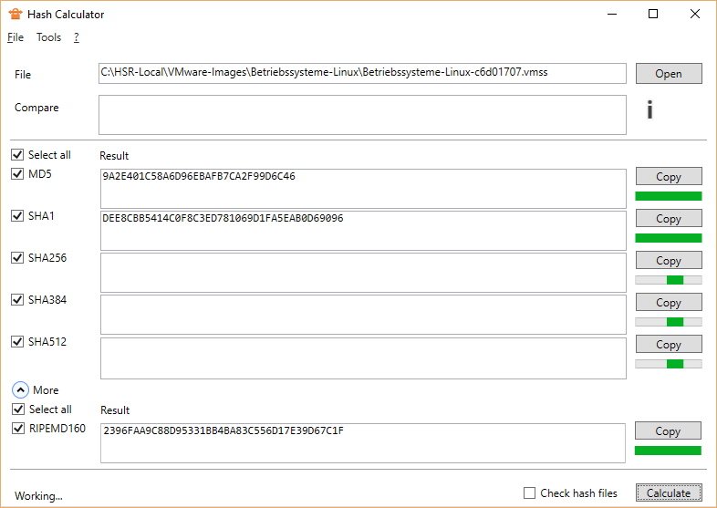

## Description
A multi-threaded, parallel Hash Calculator.

## Installation / Download
[Download](//raw.githubusercontent.com/lroellin/hash-calculator/master/Hash-Calculator/Hash-Calculator/publish/setup.exe)

Note: As this app is not yet well-known, Smart Screen will not recognize it. Click on *More Info > Run anyway*. This should get better in the future.

It is a ClickOnce application, so you have the choice to update it whenever you start it.

## Features
* Parallel calculation of hash values
* Compare hashes
* Save hash values to file
* See runtime for each algorithm (hover over progress bar)
* Algorithms
  * MD5
  * SHA1
  * SHA256
  * SHA384
  * SHA512

### Multi-Threading
* A multi-core machine can run several algorithms simultaneously
* When using several algorithms, you don't have to wait for SHA512 (slow) to finish to display the value of MD5(fast)
* The GUI does not freeze and is still usable

I did not find a decent Hash Calculator that supports all this. That does not mean other developers are incompetent, it just got a lot easier in the last years to program multi-threaded.

## Changelog
* 1.4.0:
  * Feature: Add runtime
  * Feature: Check hash files
  * Enhancement: Save hash file follows
* 1.3.1: Fix: Threading Problem
* 1.3.0:
  * Feature: Error Checks
  * Fix: Borders not resetting correctly
* 1.2.2: First public release

## Open Source
This tool is open source with an MIT license. You can fork it on [Github](https://github.com/lroellin/Hash-Calculator).
